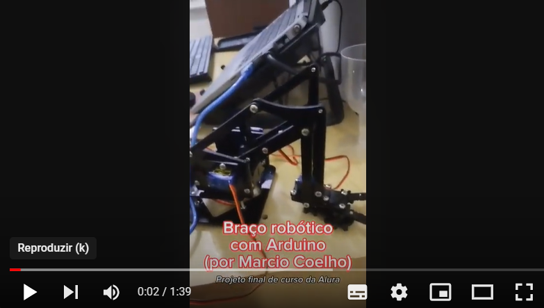

# arduino-braco-robotico

Código escrito em C++ para movimentar braço robótico de acrílico, utilizando 4 servo motores, 2 módulos joystick e uma placa Arduino.

Página do curso: https://cursos.alura.com.br/course/arduino-robotica

Projeto final (vídeo):

